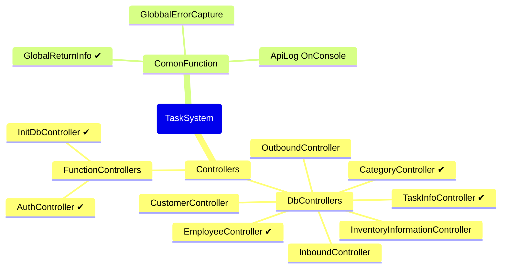

# Project Introduction

This is a cross-platform project that is intended to be designed to integrate with task management systems and inventory management systems, with the goal of implementing functionality using the most up-to-date syntax possible.

## There is a problem with the project

- If the database foreign key binding is too deep, it may not be possible to migrate from Mysql to other databases

> Thinking about implementing data validation from the application layer?

## The next goal of the project

- Add GlobbalErrorCapture
- Decouple the functions of the filter

## Project Info

The project uses environment variables to read confidential information, which is currently the most efficient and cross-platform approach, and of course it can be stored within the project, but my AI doesn't think it's secure 😂 enough.

### Requirements for the project development environment

<table>
<tr>
<th>Environment variable</th><th>Project SDK</th><th>DataBase</th>
</tr>
<tr>
<td>
    DB_LINK ,
    API_KEY ,
    ISSUER  ,
    AUDIENCE
    </td>
<td>NET 8</td>
<td>MYSQL 8.X</td>
</tr>
</table>

#### Environment variable

- DB_LINK ：数据库连接字符串
- API_KEY ：一个密钥，用于JWT验证
- ISSUER  ：JWT 验证项
- AUDIENCE：JWT 验证项

### Project development prospective design

## 已实现的功能

- 加入操作日志(控制台)
  - GlobaleLogger

- 加入环境变量读取
  - RSA_CERT_PATH ：RSA证书路径
  - API_KEY ：一个密钥，用于JWE验证
  - ISSUER  ：JWT 验证项
  - AUDIENCE：JWT 验证项
  - DB_LINK ：数据库连接字符串

- 统一数据返回
  - Result&lt;T&gt; AppFilter()

- 身份验证和授权方案[JWE]
  - BearerInfo : JWE 生成器
  - BearerConfig : JWE 验证配置
    - 使用X509证书密钥

- 数据接口
  - TaskController
  - CustomerController
  - EmployeeController
  - CategoryController
    - GetCategorys ：返回分页的分类列表
      - 基于等级
      - 基于父序
      - 默认 基于创建时间或ID
    - PostCategory ：添加分类
    - PutCategory ：修改分类
    - DeleteCategory ：删除分类
    - GetCategory ：获取分类
