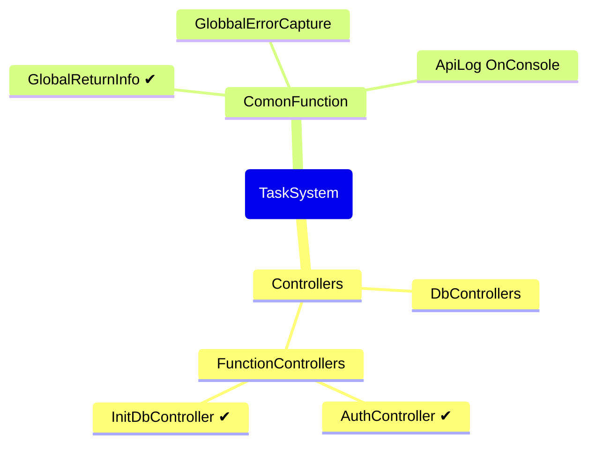

# Project Introduction

This is a cross-platform project that is intended to be designed to integrate with task management systems and inventory management systems, with the goal of implementing functionality using the most up-to-date syntax possible.

## There is a problem with the project

- If the database foreign key binding is too deep, it may not be possible to migrate from Mysql to other databases

> Thinking about implementing data validation from the application layer?

## The next goal of the project

- Add GlobbalErrorCapture => Modified to add exception filter √
- Introduce AutoMapper to my project √
- Add model validation exceptions for all apis

### Requirements for the project development environment

|Environment variable|Project SDK|DataBase|
|--|--|--|
| **as follows**⬇|[NET 8](https://dotnet.microsoft.com/zh-cn/download/dotnet/8.0)|[MYSQL 8.X](https://dev.mysql.com/downloads/installer/)|

#### Environment variable

`// - DB_LINK : database connection string`**(Obsolete)**

- CERTPATH : Path of the RSA key certificate
- API_KEY ：A key, `JWE` authentication entry
- ISSUER  ：`JWE` authentication entry
- AUDIENCE：`JWE` authentication entry
- DB_HOST_NAME : Host address or name
- DB_NAME : DtaBase Name
- DB_PART_NAME : Database account name
- DB_HOST_PASS : Password of the database host account

### Project development prospective design

## Implemented functionality

- Add operation log(`Console`)
  - GlobaleLogger.cs

- Unified data return
  - Result&lt;T&gt; AppFilter()

- Authentication and authorization schemes(`JWE`)
  - BearerInfo : JWE generator
  - BearerConfig : JWE validates the configuration
    - Use X509 certificate keys

- API
  - /api/Task
  - /api/Customer
  - /api/Employee
  - /api/Category