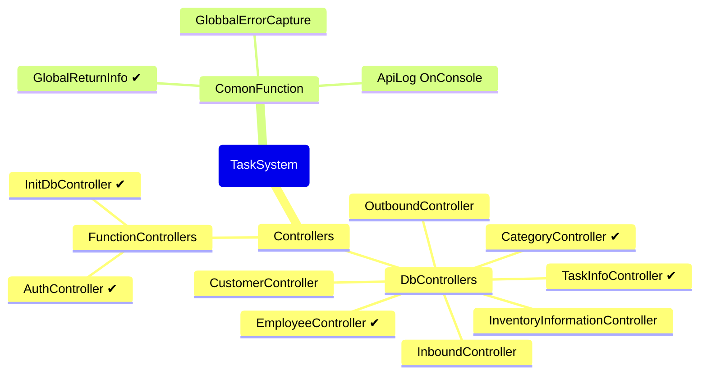

# Project Introduction

This is a cross-platform project that is intended to be designed to integrate with task management systems and inventory management systems, with the goal of implementing functionality using the most up-to-date syntax possible.

## There is a problem with the project

- If the database foreign key binding is too deep, it may not be possible to migrate from Mysql to other databases
> Thinking about implementing data validation from the application layer?

## The next goal of the project

- Add GlobbalErrorCapture
- Decouple the functions of the filter

## Project Info

The project uses environment variables to read confidential information, which is currently the most secure cross-platform implementation for a standalone system.

### Requirements for the project development environment

<table>
<tr>
<th>Environment variable</th><th>Project SDK</th><th>DataBase</th>
</tr>
<tr>
<td>
    DB_LINK ,
    API_KEY ,
    ISSUER  ,
    AUDIENCE 
    </td>
<td>NET 8</td>
<td>MYSQL 8.X</td>
</tr>
</table>

#### Environment variable
- DB_LINK ：数据库连接字符串
- API_KEY ：一个密钥，用于JWT验证
- ISSUER  ：JWT 验证项
- AUDIENCE：JWT 验证项

### 项目开发预期设计

## 备忘录

已完成目标：

- 加入操作日志(控制台)

- 加入环境变量读取

- 统一数据返回

- 身份验证和授权方案[Bearer Token]

- 取消MD5加解密，转为使用SHA-256加密

